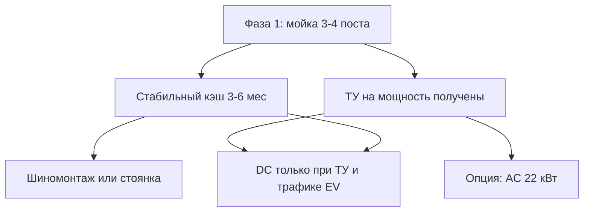

# 04. Фаза 2: шиномонтаж, стоянка, ЭЗС

Запускать **после** стабильной работы мойки (или параллельно проектировать место на генплане, но строить позже). Бюджет фазы 2 — из прибыли мойки и/или остатка лимита $50–150k.

---

## Принцип

---

## Вариант 2A. Лёгкий шиномонтаж / «отель шин»

Совпадает с назначением **СТО + мойка**.

| Параметр | Ориентир |
|----------|----------|
| CAPEX | $15–35 000 (бокс/контейнер, оборудование) |
| + хранение шин | +$3–8 000 стеллажи |
| Чистыми в сезон | +$1–3 000/мес |
| Вне сезона | существенно меньше |
| Персонал | 1 мастер (можно совмещать с оператором мойки) |

**Состав минимума:** шиномонтажный станок, балансировка, компрессор, домкрат/подъёмник (1), расходники, вывеска, запись.

**Когда делать:** если мойка даёт поток и есть свободные 100–200 м² без конфликта с заездами на посты.

---

## Вариант 2B. Охраняемая стоянка на свободной части

| Параметр | Ориентир |
|----------|----------|
| CAPEX | $5–20 000 (забор, освещение, камеры, разметка) |
| Модель | сутки / месяц для легковых или лёгких грузовиков у ЖБИ |
| Риск | спрос локальный; проверить, не противоречит ли назначению участка |

Перед стартом — устный/письменный ответ архитектуры/землеустройства: допустима ли стоянка как сопутствующее использование при основном объекте «мойка/СТО».

---

## Вариант 2C. ЭЗС

### C1. Медленные AC (допустимо раньше)

| | |
|--|--|
| Количество | 1–2× 22 кВт |
| CAPEX | $3–10 000 |
| Мощность | осторожно вписывать в остаток 75 кВт |
| Доход | низкий; скорее сервис для клиентов мойки |
| Софт | интеграция с сетью приложений (по рынку РБ) |

### C2. Быстрые DC (только после ТУ)

| | |
|--|--|
| Мощность станции | 60–120 кВт |
| CAPEX оборудования + монтаж | $25–50 000+ |
| Плюс сети по ТУ | от почти 0 до десятков тысяч $ |
| Окупаемость в Лиде | часто 3–7+ лет или не окупается |
| Условие старта | есть ТУ, известна цена сетей, есть хоть какой-то EV-трафик / такси |

**Не делать DC ядром инвестиций в первые 1–2 года.**

---

## Вариант 2D. Прочее (по приоритету)

| Идея | CAPEX | Комментарий |
|------|-------|-------------|
| Пылесосы + химчистка салона | $2–8k | апселл к мойке, делать рано |
| Грузовой пост мойки | $15–40k | если много фур к объездной/границе |
| Полноценное СТО 2–4 поста | $80–200k+ | только из прибыли / отдельный раунд |
| Аренда площадок под технику | низкий | согласовать назначение |

---

## Рекомендуемый порядок фазы 2

| Порядок | Что | Условие |
|---------|-----|---------|
| 1 | Пылесосы / мелочи у мойки | сразу с фазой 1, если бюджет |
| 2 | Запрос и получение ТУ на мощность | параллельно с фазой 1 |
| 3 | Лёгкий шиномонтаж или стоянка | после 3+ мес работы мойки |
| 4 | 1× AC 22 кВт | если осталась мощность и есть смысл |
| 5 | DC | только при ТУ + экономике |

---

## Чеклист фазы 2

- [ ] На генплане фазы 1 оставлено место под 2A/2B/2C
- [ ] Получены ТУ / отказ / лимит по мощности (вложить ответ в папку объекта)
- [ ] Посчитана юнит-экономика шиномонтажа на сезон Лиды
- [ ] Для стоянки — подтверждение допустимости
- [ ] Для DC — смета сетей + прогноз кВт·ч/мес
- [ ] Решение «делаем / не делаем» зафиксировано датой
